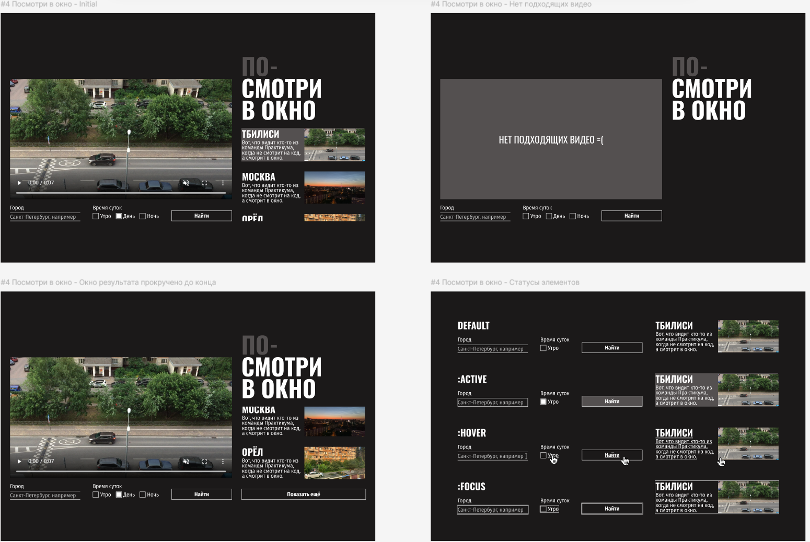

# Посмотри в окно
**Посмотри в окно** - это интерактивная страница, предоставляющая возможность просмотра видео с выбранным  городом из списка, в определенное время суток.  

## Функциональность приложения:
- При загрузке страницы скрипт получает данные из внешнего источника, отрисовывает пять карточек с видео и кнопку, чтобы подгрузить дополнительные карточки. Ещё он подставляет адрес первого из загруженных роликов в тег `<video>`.
- Скрипт отслеживает клик по карточкам и переключает текущее видео в зависимости от выбранной карточки.
- А ещё скрипт следит за отправкой формы. После отправки он ищет в базе данных совпадения по введённым параметрам и перерисовывает страницу с данными, полученными из нового запроса.
- В случае ошибок на место блока с видео подставляется блок с сообщением об ошибке. А пока идёт поиск, в блоки с видео и карточками подставляются прелоадеры, отображающие анимацию процесса загрузки.

---
## Обзор проекта

 Ссылка на макет [Figma](https://www.figma.com/design/QHcvX1RsUI89CulRB7HLk6/).

---
## Было сделано:
- Написан CSS к приложению.
---
## Стек
HTML, CSS, JavaScript
